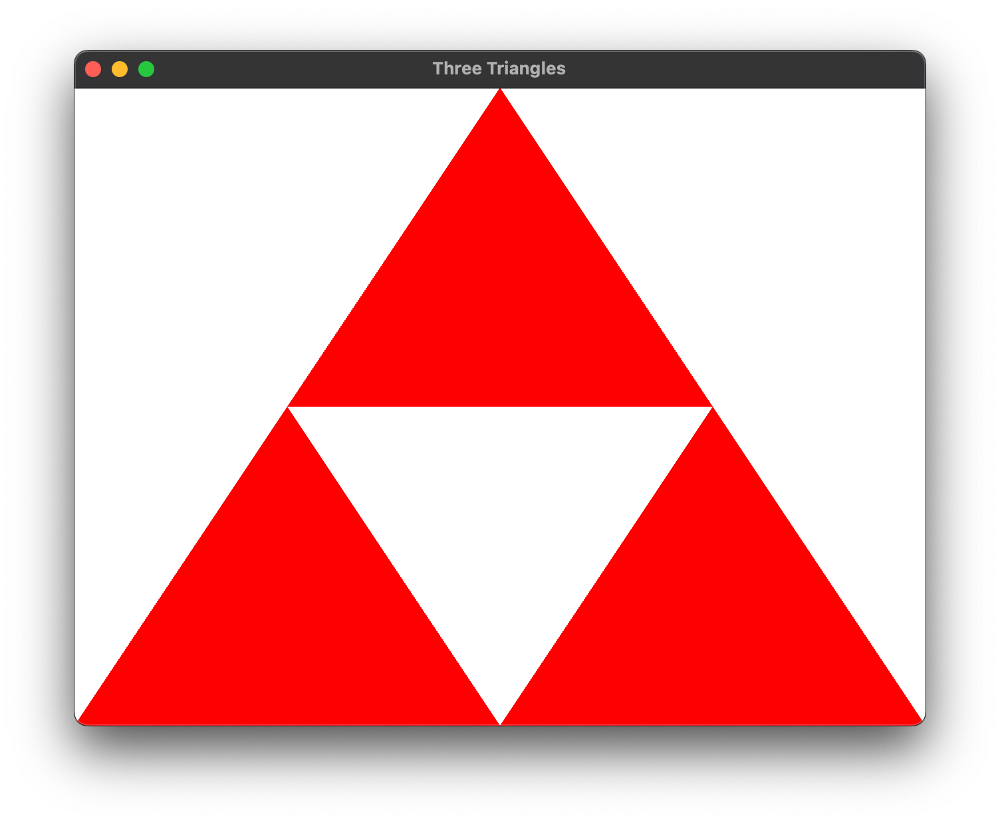
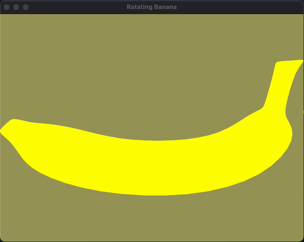

# computer-graphics-course

### 1. Triangles

📝 꼭지점을 공유하는 삼각형 3개를 그려보자 ❗️

---

### 2. Rotating Banana

📝 3차원에서 바나나를 돌려보자 ❗️

 

 

---

### 3. Lighted Hebe

📝 3차원에서 Viewing과 Lighting을 적용해보자 ❗️

 

